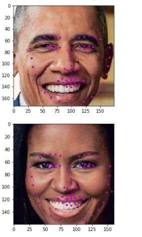

# Facial Keypoint Detection

## Project Overview

This project combines the knowledge of computer vision techniques and deep learning architectures to build a facial keypoint detection system. Facial keypoints include points around the eyes, nose, and mouth on a face and are used in many applications. These applications include: facial tracking, facial pose recognition, facial filters, and emotion recognition. Your completed code should be able to look at any image, detect faces, and predict the locations of facial keypoints on each face; examples of these keypoints are displayed below.

  

  

The project is broken up into a few main parts in four Python notebooks

__Notebook 1__ : Loading and Visualizing the Facial Keypoint Data

__Notebook 2__ : Defining and Training a Convolutional Neural Network (CNN) to Predict Facial Keypoints

__Notebook 3__ : Facial Keypoint Detection Using Haar Cascades and your Trained CNN

__Notebook 4__ : Fun Filters and Keypoint Uses

### Results from the project

  

    

